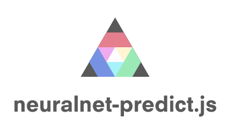

<p align="center">
  
</p>

Run trained deep neural networks in the browser or node.js. Currently supports serialization from trained [Keras](https://github.com/fchollet/keras/) models.

**[PROJECT PAGE AND EXAMPLES](https://scienceai.github.io/neocortex)**

[](https://travis-ci.org/scienceai/neocortex)
[](https://www.npmjs.com/package/neocortex-js)
[](http://dx.doi.org/10.5281/zenodo.44692)

### Background

Training deep neural networks on any meaningful dataset requires massive computational resources and lots and lots of time. However, the forward pass prediction phase is relatively cheap - typically there is no backpropagation, computational graphs, loss functions, or optimization algorithms to worry about.

What do you do when you have a trained deep neural network and now wish to use it to power a part of your client-facing web application? Traditionally, you would deploy your model on a server and call it from your web application through an API. But what if you can deploy it _in the browser_ alongside the rest of your webapp? Computation would be offloaded entirely to your end-user!

Perhaps most users will not be able to run billion-parameter networks in their browsers quite yet, but smaller networks are certainly within the realm of possibility.

The goal of this project is to provide a lightweight javascript library that can take a serialized Keras, Caffe, Torch or [insert other deep learning framework here] model, together with pre-trained weights, pack it in your webapp, and be up and running. Currently supports serialization from trained [Keras](https://github.com/fchollet/keras/) models.

### Examples

- MNIST multi-layer perceptron / [src](https://github.com/scienceai/neocortex/tree/master/examples/mnist_mlp) / [demo](http://scienceai.github.io/neocortex/mnist_mlp)

- CIFAR-10 VGGNet-like convolutional neural network / [src](https://github.com/scienceai/neocortex/tree/master/examples/cifar10_cnn) / [demo](http://scienceai.github.io/neocortex/cifar10_cnn)

- LSTM recurrent neural network for classifying astronomical object names / [src](https://github.com/scienceai/neocortex/tree/master/examples/astro_lstm) / [demo](http://scienceai.github.io/neocortex/astro_lstm)

You can also run the examples on your local machine at [`http://localhost:8000`](http://localhost:8000):

```sh
$ npm run examples-server
```


### Usage

See the source code of the examples above. In particular, the CIFAR-10 example demonstrates a multi-threaded implementation using Web Workers.

In the browser:

```html
<script src="neocortex.min.js"></script>
<script>
  // use neural network here
</script>
```

In node.js:

```sh
$ npm install neocortex-js
```

```js
import NeuralNet from 'neocortex-js';
```

The core steps involve:

1. Instantiate neural network class

  ```js
  let nn = new NeuralNet({
    // relative URL in browser/webworker, absolute path in node.js
    modelFilePath: 'model.json',
    arrayType: 'float64', // float64 or float32
  });
  ```

2. Load the model JSON file, then once loaded, feed input data into neural network

  ```js
  nn.init().then(() => {
    let predictions = nn.predict(input);
    // make use of predictions
  });
  ```


### Build

To build the project yourself, for both the browser (outputs to `build/neocortex.min.js`) and node.js (outputs to `dist/`):

```
$ npm run build
```

To build just for the browser:

```
$ npm run build-browser
```

### Frameworks

###### Keras

A script to serialize a trained [Keras](http://keras.io/) model together with its `hdf5` formatted weights is located in the `utils/` folder [here](https://github.com/scienceai/neocortex/blob/master/utils/serialize_keras.py). It currently only supports sequential models with layers in the API section below. Implementation of graph models is planned.


### API

Functions and layers currently implemented are listed below. More forthcoming.

##### Activation functions

+ `linear`

+ `relu`

+ `sigmoid`

+ `hard_sigmoid`

+ `tanh`

+ `softmax`

##### Advanced activation layers

+ `leakyReLULayer`

+ `parametricReLULayer`

+ `parametricSoftplusLayer`

+ `thresholdedLinearLayer`

+ `thresholdedReLuLayer`

##### Basic layers

+ `denseLayer`

+ `flattenLayer`

##### Recurrent layers

+ `rGRULayer` (gated-recurrent unit or GRU)

+ `rLSTMLayer` (long short-term memory or LSTM)

+ `rJZS1Layer`, `rJZS2Layer`, `rJZS3Layer` (mutated GRUs - JZS1, JZS2, JZS3 - from [Jozefowicz et al. 2015](http://jmlr.org/proceedings/papers/v37/jozefowicz15.pdf))

##### Convolutional layers

+ `convolution2DLayer`

+ `maxPooling2DLayer`

+ `convolution1DLayer`

+ `maxPooling1DLayer`

##### Embedding layers

+ `embeddingLayer` - maps indices to corresponding embedding vectors

##### Normalization layers

+ `batchNormalizationLayer` - see [Ioffe and Szegedy 2015](http://arxiv.org/abs/1502.03167)

### Todo

+ [ ] implement merge and graph structures from keras

+ [ ] implement additional keras layers such as TimeDistributedDense, etc.

### Tests

```
$ npm test
```

Browser testing is planned.


### Credits

Thanks to @halmos for the logo.


### License

[Apache 2.0](https://github.com/scienceai/neocortex/blob/master/LICENSE)
